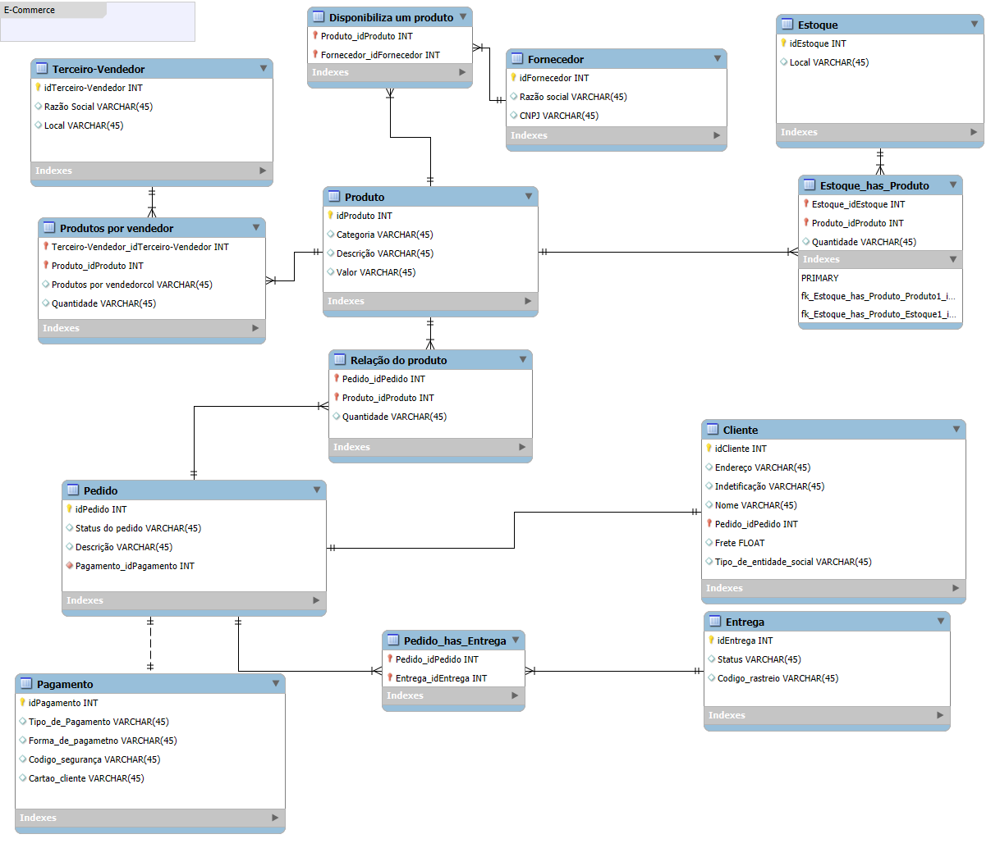

# AnaliseDeDados

o que aprendizado de maquina?

1 - Dados de treinamento.
2 - Algoritmo
3 - Modelo
4 - Inferencia de dados
5 - Predição

Entrega modelo conceitual E-Commerce

Pontos para refino:
Cliente PJ e PF – Uma conta pode ser PJ ou PF, mas não pode ter as duas informações;
    Coloquei um atributo para destinguir esses valores em cliente.
Pagamento – Pode ter cadastrado mais de uma forma de pagamento;
    Crie uma entidade 
Entrega – Possui status e código de rastreio;
    Crie uma entidade 
