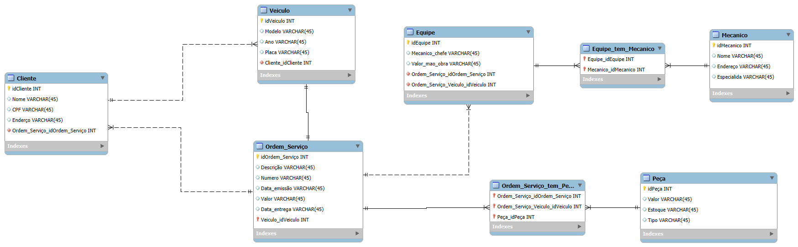

# AnaliseDeDados

o que aprendizado de maquina?

1 - Dados de treinamento.
2 - Algoritmo
3 - Modelo
4 - Inferencia de dados
5 - Predição

Entrega modelo conceitual E-Commerce

Pontos para refino:
Cliente PJ e PF – Uma conta pode ser PJ ou PF, mas não pode ter as duas informações;
    Coloquei um atributo para destinguir esses valores em cliente.
Pagamento – Pode ter cadastrado mais de uma forma de pagamento;
    Crie uma entidade 
Entrega – Possui status e código de rastreio;
    Crie uma entidade 

Objetivo:
Cria o esquema conceitual para o contexto de oficina com base na narrativa fornecida

Narrativa:
Sistema de controle e gerenciamento de execução de ordens de serviço em uma oficina mecânica
Clientes levam veículos à oficina mecânica para serem consertados ou para passarem por revisões  periódicas
Cada veículo é designado a uma equipe de mecânicos que identifica os serviços a serem executados e preenche uma OS com data de entrega.
A partir da OS, calcula-se o valor de cada serviço, consultando-se uma tabela de referência de mão-de-obra
O valor de cada peça também irá compor a OSO cliente autoriza a execução dos serviços
A mesma equipe avalia e executa os serviços
Os mecânicos possuem código, nome, endereço e especialidade
Cada OS possui: n°, data de emissão, um valor, status e uma data para conclusão dos trabalhos.

